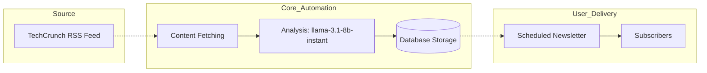

# TechDaily: Automated Tech News Platform
> ### 🌟 **Want the n8n Workflow?**
> If you find this project useful, please star the repository and I'll grant the access to my private repository where you'll find the n8n workflow for free!


TechDaily is an autonomous system designed to handle the full lifecycle of technology news, from initial collection to final delivery. The platform removes the need for manual editorial work by combining automated data fetching, AI-driven content analysis, and scheduled distribution through newsletters.

## System Architecture

The project is built around an n8n automation layer that coordinates the movement of data between external sources, the processing engine, and the application database.



### Content Pipeline
The system monitors [TechCrunch](https://techcrunch.com) for new technical stories. When new content is identified, it is processed by the Groq AI engine using the llama-3.1-8b-instant model. The AI extracts the core facts and generates metadata, including categories and SEO-friendly summaries. This structured data is then stored in MongoDB for retrieval by the web interface.

### Newsletter Distribution
Audience engagement is handled through automated newsletters with schedules managed by **Supabase cron jobs** triggering n8n workflows. Articles are selected based on relevance and performance, then sent to subscribers on the following refined schedules:
- **Daily**: 10 articles sent every morning.
- **Weekly**: 15 articles sent every 7 days.
- **Monthly**: 20 articles sent every 30 days.

## Technology Stack

- **Frontend**: Next.js 16 utilizing the App Router and Server Components.
- **Styling**: Tailwind CSS 4 for a modern and responsive user interface.
- **Database**: MongoDB for persistent storage of articles and subscriber information.
- **Automation & Scheduling**: n8n for workflow orchestration and **Supabase** for robust cron job management.
- **AI Engine**: Groq utilizing the llama-3.1-8b-instant model for high-speed content processing.
- **Email Delivery**: NodeMailer for sending automated newsletters.

## Getting Started

### Prerequisites
- Node.js (Latest stable version, v20 or higher recommended)
- A running MongoDB instance
- An n8n environment for automation workflows
- A Groq API key for content processing

### Installation

1. **Clone the repository**:
   ```bash
   git clone https://github.com/your-username/techdaily.git
   cd techdaily
   ```

2. **Install dependencies**:
   ```bash
   bun install
   ```

3. **Configure Environment Variables**:
   Create a .env file in the root directory with the following settings:
   ```env
   # Database
   MONGODB_URI=your_mongodb_connection_string

   # Email Credentials
   EMAIL_USER=your_email@example.com
   EMAIL_PASS=your_app_specific_password
   EMAIL_SENDER=sender_name_or_email

   # Application Links
   NEXT_PUBLIC_BASE_URL=http://localhost:3000
   PROD_URL=https://yourdomain.com

   # Security
   CRON_SECRET=your_secure_cron_token
   ```

4. **Run the application**:
   ```bash
   bun run dev
   ```

## Newsletter Subscription
The platform includes a built-in subscription mechanism. User preferences and contact details are stored in the database, allowing n8n to trigger the correct newsletter dispatch based on the daily, weekly, or monthly schedules.

## License
This project is licensed under the MIT License. Detailed terms can be found in the LICENSE file.
